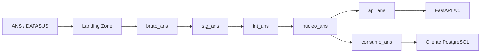

# Lineage Fase 4

```mermaid
flowchart LR
    ANS["ANS / DATASUS"] --> Landing["Landing Zone"]
    Landing --> Bronze["bruto_ans"]
    Bronze --> Staging["stg_ans"]
    Staging --> Intermediate["int_ans"]
    Intermediate --> Gold["nucleo_ans"]
    Gold --> API["api_ans"]
    Gold --> Consumo["consumo_ans"]
    API --> FastAPI["FastAPI /v1"]
    Consumo --> Cliente["Cliente PostgreSQL"]
```
